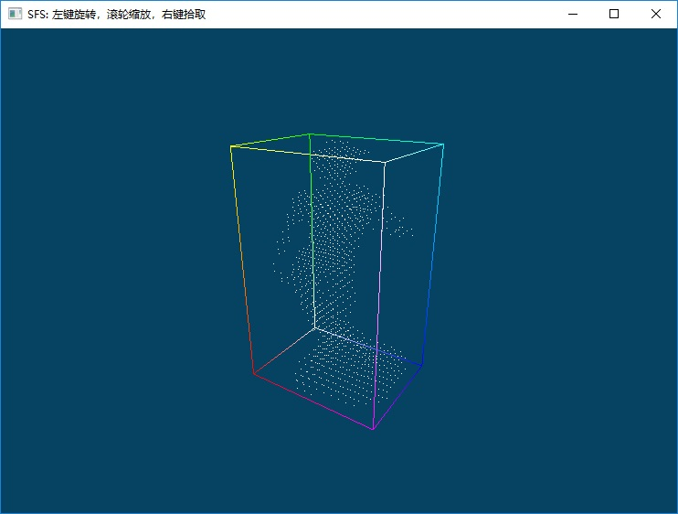

# SFS

Generating 3D point clouds from their silhouettes in a sequence of images.

compile:
	tools: vs2015.
	but, before compile this code, you should download and put twe file "bin/opencv_world330.dll" and "bin/opencv_world330d.dll", they are two bigger, I remove from the "bin" folder.
	
running:
	After compilation, the SFS.exe file will be generated under the "bin" folder and double click to run.
	
	notice:
		/data: store the test data(imgage and their projection parameters).
		/bin:  store the SFS.exe and necessary dynamic library files < freeglut.dll, glew32.dll, GLU.DLL, glut.dll, glut32.dll, opencv_world330.dll, opencv_world330d.dll, OPENGL.DLL >.

["Matlab code:"](https://github.com/KKeishiro/Shape-from-Silhouettes)
